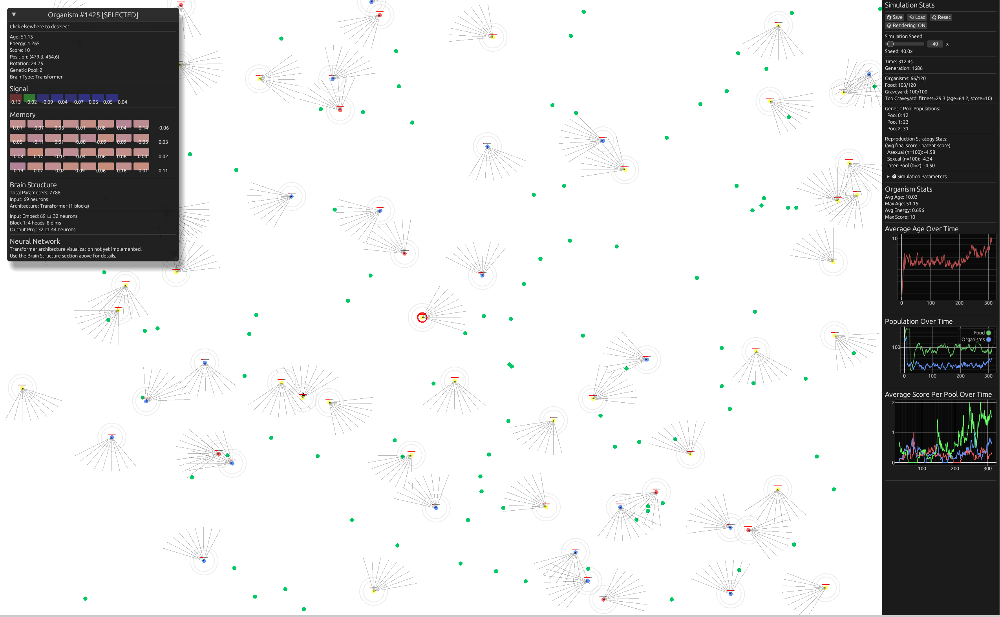

# Evolutionary Neural Network Simulation

> [!NOTE]
> This project was developed with extensive use of agentic AI coding tools (Claude Code CLI).



## Description

A high-performance evolutionary simulation where organisms with neural network brains compete for survival. Organisms perceive their environment through vision, proprioception, and scent, then use their brains (MLPs or Transformers) to decide actions like movement, rotation, attacking, and energy sharing.

**Key Features:**
- **Parallel simulation** using Rayon for multi-threaded organism updates
- **Multiple reproduction strategies:** Asexual cloning, sexual crossover, and inter-pool breeding
- **Genetic pools** for speciation and diversity
- **Rich sensory perception:** Vision raycasting, proprioception, and scent detection
- **Event-driven architecture** for thread-safe state updates
- **Spatial indexing** with KD-trees for efficient neighbor queries

Evolution happens through selection pressure - successful organisms contribute their genes to future generations through fitness-based breeding from a graveyard of deceased organisms.

**Inspiration:** Based on concepts from [this video](https://www.youtube.com/watch?v=RjweUYtpNq4)

## Running the Code

To run the code, you need to rust installed. You can install it from [rustup.rs](https://rustup.rs/).

After installing Rust, you can run the code with the following command:

```bash
cargo run
```

### Check everything before committing
make all

### Just format
make fmt

### Just lint  
make clippy

### Generate docs
make doc
