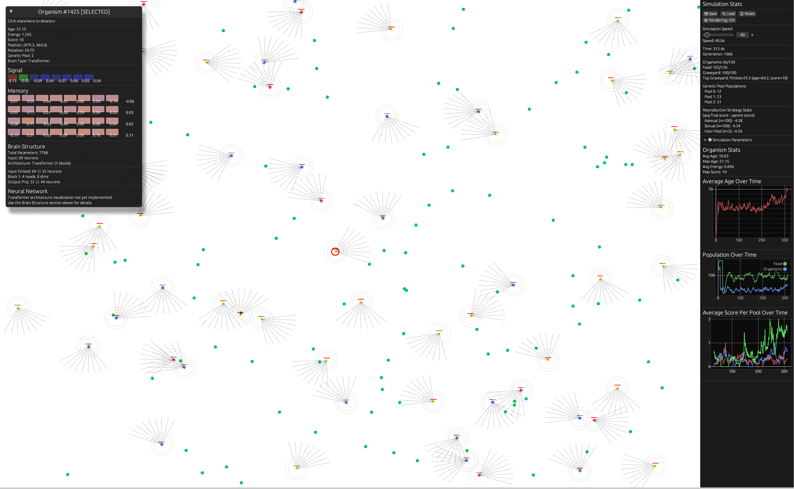

# Evolutionary Neural Network Simulation

> [!NOTE]
> This project was developed with extensive use of agentic AI coding tools (Claude Code CLI).



## Overview

A high-performance evolutionary simulation where organisms with neural network brains (MLPs or Transformers) compete for survival. Organisms perceive their environment through vision, scent, and proprioception, then decide actions like movement, attacking, and energy sharing.

**Key Features:**
- **Brain architectures:** MLP or Transformer networks with targeted mutation
- **Parallel simulation:** Multi-threaded updates with Rayon, BLAS-accelerated matrix ops
- **Evolution mechanisms:** Asexual/sexual reproduction, genetic pools, fitness-based selection
- **Rich interactions:** Vision raycasting, projectile combat, energy sharing, reproduction
- **Dynamic environment:** Drifting food and spawn clusters
- **Real-time visualization:** Interactive UI with camera zoom, organism tracking, performance plots

## Quick Start

```bash
# Install Rust from rustup.rs
cargo run --release
```

**Controls:**
- Mouse wheel: Zoom in/out
- Click organism: Select/deselect
- Hover: View organism details
- Ctrl+S/L: Save/load simulation

## Development

```bash
make all      # Format, lint, test
make fmt      # Format code
make clippy   # Run linter
make doc      # Generate documentation
```

**Inspiration:** Based on concepts from [this video](https://www.youtube.com/watch?v=RjweUYtpNq4)
